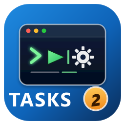

# Tasks2

> Forked from [actboy168/vscode-tasks](https://github.com/actboy168/vscode-tasks)
> and maintained by [Dragos Catalin](https://github.com/dragoscv).

Tasks2 loads your VS Code tasks into the status bar. By default it adds a single
**Tasks** dropdown button on the right side of the status bar; clicking it opens
a Quick Pick listing every task. You can switch to the legacy "show every task
as its own button" mode from settings.



## Display modes

Two presentations are available, configurable via `tasks.statusbar.displayMode`:

| Mode | What you see |
| ---- | ------------ |
| `menu` *(default)* | A single `$(checklist) Tasks` button. Clicking it opens a vertical Quick Pick of all tasks. |
| `all` | Every task is rendered as its own status bar item (legacy behavior). |

A small `⋮` button next to the Tasks dropdown opens an actions menu (Open
Settings, Refresh Tasks, Edit `tasks.json`, …). It exists because the VS Code
extension API does not currently allow extensions to contribute custom right-click
context menus on status bar items
([microsoft/vscode#27196](https://github.com/microsoft/vscode/issues/27196)).
You can disable it with `tasks.statusbar.menu.showActionsButton`.

You can also reach the same actions through:

- The Quick Pick gear/refresh buttons (top-right of the dropdown).
- The Command Palette: `Tasks2: Open Settings`, `Tasks2: Show Actions Menu`,
  `Tasks2: Refresh Tasks`.
- The `Open Settings` link inside the button's tooltip.

## Settings

| Setting | Default | Description |
| ------- | ------- | ----------- |
| `tasks.statusbar.displayMode` | `menu` | `menu` or `all`. |
| `tasks.statusbar.alignment` | `right` | `left` or `right` side of the status bar. |
| `tasks.statusbar.priority` | `50` | Status bar item priority. |
| `tasks.statusbar.menu.label` | `Tasks` | Text on the dropdown button. |
| `tasks.statusbar.menu.icon` | `checklist` | Codicon id used on the dropdown button. |
| `tasks.statusbar.menu.showActionsButton` | `true` | Show the extra `⋮` actions button. |
| `tasks.statusbar.default.hide` | `false` | Hide all tasks by default. |
| `tasks.statusbar.default.color` | `""` | Default color for status bar items. |
| `tasks.statusbar.limit` | `null` | (mode `all` only) Maximum number of items before tasks overflow into a Quick Pick. |
| `tasks.statusbar.select.label` | `...` | Label of the overflow item in mode `all`. |
| `tasks.statusbar.select.color` | `""` | Color of the overflow item in mode `all`. |

## Per-task options
You can hide some tasks with the following options directly in `tasks.json`:

```json
"label": "Test",
"options": {
  "statusbar": {
    "hide" : true
  }
}
```

You can set the label of the statusbar:

```json
"label": "Test",
"options": {
  "statusbar": {
    "label" : "ts"
  }
}
```

You can embed icons in the text by leveraging the syntax: `$(icon-name)`. More details in [icons-in-labels](https://code.visualstudio.com/api/references/icons-in-labels) and [octicons](https://octicons.github.com)

```json
"label": "Test",
"options": {
  "statusbar": {
    "label" : "$(beaker) ts"
  }
}
```

You can set the foreground color of the statusbar:

```json
"label": "Test",
"options": {
  "statusbar": {
    "color" : "#22C1D6"
  }
}
```

You can set the tooltip of the statusbar:

```json
"label": "Test",
"options": {
  "statusbar": {
    "detail" : "my test"
  }
}
```

You can enable statusbar items based on the file in the active editor using the `filePattern` attribute, causing the statusbar item to be hidden when the active file does not match the specified pattern. If the `filePattern` attribute is not provided, the statusbar item will not be hidden based on the active file. Also, if it is provided but is invalid or causes an error during validation, the statusbar item will not be displayed. (Note that `filePattern` only applies to statusbar items that have not been otherwise effectively set as hidden through `tasks.json` or `settings.json`).

For instance, the following would only display the "Test" button when a filename beginning with `test_` is the active editor:

```json
"label": "Test",
"options": {
  "statusbar": {
    "filePattern" : "test_.*"
  }
}
```

## Credits

- Original project: [actboy168/vscode-tasks](https://github.com/actboy168/vscode-tasks) by [actboy168](https://github.com/actboy168).
- Tasks2 fork & maintenance, dropdown menu, configurable alignment, actions menu, new logo: [Dragos Catalin](https://github.com/dragoscv).

## License

MIT - see [LICENSE](./LICENSE).
